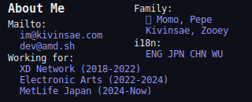
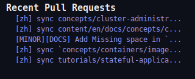

 

---

<!--
<!DOCTYPE html>
<html>
<head>
</head>
<body>

<table>
    <tr>
        <td></td>
        <td></td>
    </tr>
    <tr>
        <td></td>
        <td></td>
    </tr>
    <tr>
        <td></td>
        <td></td>
    </tr>
    <tr>
        <td>
        
         
        
         
        
         
        
         
        
        </td>
        <td></td>
    </tr>
</table>

</body>
</html>
-->
